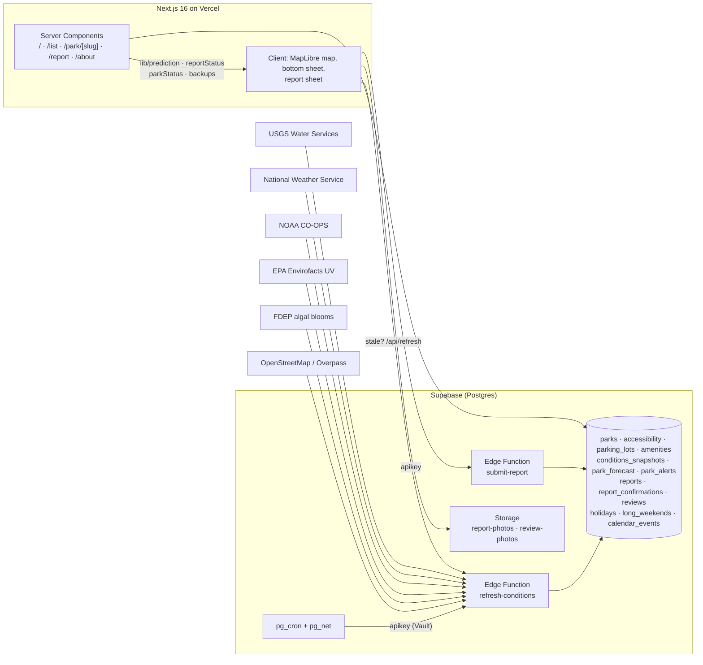

# LakeLens 🌊

**Check the gate before you drive.** Closure estimates, one-tap visitor reports, parking, amenities and accessibility for freshwater swim spots.

Made by Kenzo Fukuda, a student at the University of Florida. LakeLens covers springs, lakes and rivers: the places that close at capacity before 10 AM on a summer Saturday, after families have already driven two hours to get there. The product is built for the whole US; today's data covers Florida, where 40 parks are live.

**Live app:** https://lakelens-kenzo-fukudas-projects.vercel.app · **Tracks:** Social Impact + Best Design

---

## The problem

- Popular springs (Ichetucknee, Rainbow, Blue Spring, Wekiwa…) hit capacity on weekends and holidays and **close to everyone**, even people with reservations. Families find out at the gate after a two-hour drive.
- Nothing tells you how busy a park is running today, and nobody tells you which nearby park still has room.
- Visitors using wheelchairs can't tell in advance whether there's a ramp, an accessible restroom or a loaner water wheelchair.
- Many springs have **no lifeguard**, underwater cave entrances that have killed untrained swimmers, 72 °F water that tires people fast, and river currents that change with rain. That information is scattered across a dozen sites.

## Why freshwater only

A swim spot is worth checking ahead only if it has a gate that can shut. Springs, lakes and rivers inside parks do: they fill, they close for the night, they close for a season. That is the whole premise of the app, so the scope is freshwater: **40 parks, 31 springs, 6 lakes and 3 rivers**.

## What LakeLens does

| Feature | How |
|---|---|
| **Map + list of 40 freshwater swim spots**: springs, lakes and rivers, state parks plus county and private springs | Curated data + FDEP GIS centroids; deep parks use spring-vent coordinates |
| **"How busy today?"** with the reasons shown | Transparent scoring model, described below. It never claims a park will fill: at worst it says *Busier than usual today* |
| **Hours-aware status** | Opening hours are parsed per park and sunset is computed from the NOAA solar equations, so a park shut at 2 a.m. reads shut. Every park carries an IANA `time_zone` |
| **One-tap visitor reports** (turned away / got in / line / lot full / gator / ramp blocked…) | Anonymous device id, no login; 5 reports / 10 min rate limit; reports fade after 2 h; 3 matching reports within 30 min = *confirmed* |
| **"Still full?" prompts** | Waze-style confirmation when a "full" report is getting old |
| **Backup suggestions** | When a park is full/closed: up to 3 nearby parks with room, drive time, parking and accessible-entry info |
| **Live conditions** | NWS forecast and alerts for every park, feels-like from the raw NWS gridpoint (`apparentTemperature`, with a Rothfusz heat-index fallback) plus `probabilityOfThunder`, EPA Envirofacts UV index per park by lat/lng, USGS flow / level / water temperature, NOAA CO-OPS water temperature, all refreshed by a Supabase Edge Function on pg_cron |
| **Hourly forecast per park** | A `park_forecast` table holds one upserted row per park with columnar hourly arrays, so a park page reads a single row |
| **Official closures as data** | Closures are `park_alerts` rows evaluated at request time: deactivate the alert and the park reopens automatically |
| **Safety card** | Lifeguard status, cavern warnings, current + cold-water advice, alcohol / life-jacket rules per park |
| **Parking + accessibility** | Curated lots (fees, ADA spaces, overflow, "no roadside waiting"), water-entry type, surfaces, restrooms, each marked *verified* or *unverified* with its source |
| **Amenities** | Restrooms, showers, pavilions, docks, boat ramps, grills, picnic tables, drinking water, boat rental, food and playgrounds, pulled from OpenStreetMap inside the park boundary |
| **Visitor reviews** | 1 to 5 stars with text and up to 4 photos, aggregated by a `park_review_stats` view |
| **Parking that keeps itself current** | OpenStreetMap lots refreshed daily from Overpass (a slice of parks per run), merged with the curated lots |
| **Self-healing coverage** | A weekly job assigns a USGS gauge, NOAA station or NWS grid to any park missing one, so new sensors get picked up without a redeploy |
| **Installable PWA** | Manifest + service worker; works offline for the basics |
| **Accessibility first** | Status is always icon + text, never colour alone; 44 px targets; screen-reader-friendly list view; 200 % zoom safe |

## Architecture



- **Frontend:** Next.js 16 (App Router, ISR `revalidate = 60`), TypeScript, Tailwind v4 (CSS-first design tokens), MapLibre GL via `@vis.gl/react-maplibre` with keyless [OpenFreeMap](https://openfreemap.org) vector tiles, `vaul` for modal sheets, hand-rolled persistent bottom sheet.
- **Backend:** Supabase Postgres with RLS (public read, no anonymous writes to tables), Edge Function `submit-report` (validation + rate limiting, service-role insert, DB trigger as backstop), Storage buckets for report and review photos, `pg_cron` + `pg_net` driving the `refresh-conditions` Edge Function. Cron jobs: `usgs`, `noaa`, `weather`, `alerts`, `algae`, `holidays`, `prune`, `parking`, `stations`, `forecast`, `amenities`. Ingestion runs entirely inside Supabase, so it keeps collecting even if the web deployment is down. Secrets live in Supabase Vault.
- **Pure logic** in `lib/` (no React/DB imports): prediction, report summarisation, status blending, hours and sunset, backups, freshness, plain-language helpers. 259 tests in all.
- **Deploy gate:** `vercel-build` runs `npm run check` (tsc + eslint + vitest) before `next build`, so a red test never ships. The same checks run in GitHub Actions from `.github/workflows/ci.yml`.

### How the closure estimate works (`lib/prediction.ts`)

A transparent additive score, shown to the user as plain reasons under the heading **How busy today?**:

| Factor | Points |
|---|---|
| Weekend | +2 |
| Public holiday or holiday weekend | +3 |
| College event / break (UF home games, spring break, summer) | +1 to +2 |
| Forecast high ≥ 90 °F / ≥ 95 °F | +1 / +3 |
| Rain chance ≥ 50 % | −2 |
| Active official closure, outside opening hours, or out of swim season (Blue Spring manatee season) | → **Closed** |

Score 0 or less means a normal day, 1 to 2 means somewhat busier, 3 or more reads **Busier than usual today**. The score never claims a park will fill and never marks it Full: only an official closure, park hours, the swim season or a "turned away" report changes the status. The park's *typical* weekend fill time (curated from official notices and news) is shifted **25 min earlier per point above 2**. Confidence reflects how much live data was available.

### How reports become a status (`lib/reportStatus.ts`, `lib/parkStatus.ts`)

1. Only reports from the last **2 hours** count; newer reports weigh more.
2. **3 matching reports within 30 minutes** count as *confirmed*; 1 or 2 count as *reported*.
3. A contradicting report (got in after turned away) lowers confidence; a majority of "no longer" confirmations clears the signal.
4. Final status priority: **official closure alert → park hours → swim season → confirmed reports → single report that agrees with the outlook → outlook alone → unknown**. The same function feeds the map, the list and the park page.

### Verified vs. sample vs. unverified

- Park facts for the deep-coverage parks were curated from official pages, with `sources[]` recorded in `data/parks.deep.json` and `data/parks.extra.json`.
- Accessibility fields are marked **verified** only when an official page states them; everything else is **unverified** and says so.
- Demo reports are seeded with `is_sample = true` and rendered with a **Sample data** badge. Real reports have none.
- Official alerts are entered manually (state park sites block server-side fetches) and are labelled "entered manually · last checked …".

## Data sources

- [USGS Water Services](https://api.waterdata.usgs.gov/): river discharge, gauge height, water temperature (public domain)
- [National Weather Service API](https://www.weather.gov/documentation/services-web-api): forecasts, active alerts and raw gridpoint data for feels-like and thunder probability (public domain)
- [NOAA CO-OPS Tides & Currents](https://api.tidesandcurrents.noaa.gov/): water temperature, including the Great Lakes (public domain)
- [EPA Envirofacts UV](https://data.epa.gov/): hourly UV index by coordinates (public domain)
- [FDEP algal bloom sampling](https://floridadep.gov/AlgalBloom): freshwater cyanobacteria sampling (public domain)
- [Nager.Date](https://date.nager.at/): US public holidays
- [OpenStreetMap](https://www.openstreetmap.org/copyright) contributors via [OpenFreeMap](https://openfreemap.org): map tiles, and the Overpass API for parking lots and amenities
- [FDEP Florida State Parks boundaries](https://geodata.dep.state.fl.us/): park centroids
- Florida State Parks, Alachua County Parks, Ginnie Springs Outdoors: hours, fees, rules and accessibility, curated by hand

## Run locally

```bash
cp .env.example .env.local   # Supabase URL + keys, ADMIN_TOKEN
npm install
npm run dev
```

- `npm test` runs vitest (prediction, reports, status, hours and sunset, backups, ingestion normalisers, Overpass/station assignment, seed validation)
- `npm run check` runs tsc + eslint + vitest, the same gate `vercel-build` and CI run
- `npm run lint` · `npm run build`
- `node --experimental-strip-types scripts/build-seed.ts` regenerates `supabase/seed.sql` from `data/*.json`
- Migrations: `supabase/migrations/*.sql` (`npx supabase db push --include-seed`), one-time Vault setup in `supabase/migrations/README.md`
- Edge Functions: `npx supabase functions deploy submit-report --use-api` · `npx supabase functions deploy refresh-conditions --use-api`

## Repository map

```
app/            routes (map, list, park/[slug], report, about, offline) + /api (refresh proxy, admin alerts, reports fallback, flow history)
components/     ui primitives · map · list · sheet · park sections · report flow · reviews · nav · pwa · a11y
lib/            pure logic (prediction, reportStatus, parkStatus, hours, sunset, backups, freshness…) · ingest shims (usgs, nws, noaa, epa, gauges) · queries · supabase clients
data/           curated seed JSON: deep parks, accessibility, parking, amenities, alerts, sample reports, events, holidays
                (seed source only; the app always reads Postgres, and fetch caches are gitignored)
scripts/        seed builder, FDEP / NWS / EPA / Overpass / holiday fetchers
supabase/       migrations, seed.sql, config, functions/{submit-report, refresh-conditions, _shared}
tests/          ingestion fixtures + tests, seed validation
.github/        CI workflow (tsc, eslint, vitest)
```

## Roadmap

More freshwater parks beyond Florida, state by state, then Great Lakes water quality, then Army Corps of Engineers lakes. Stretch: Claude-assisted classification of free-text report notes, richer algae alerts, per-park UV history.

## Team

Built with Next.js, Supabase, Vercel and Claude Code.

## Disclaimer

Informational only. Conditions change quickly and estimates can be wrong. Follow posted rules and park staff. LakeLens is not affiliated with any park operator.
