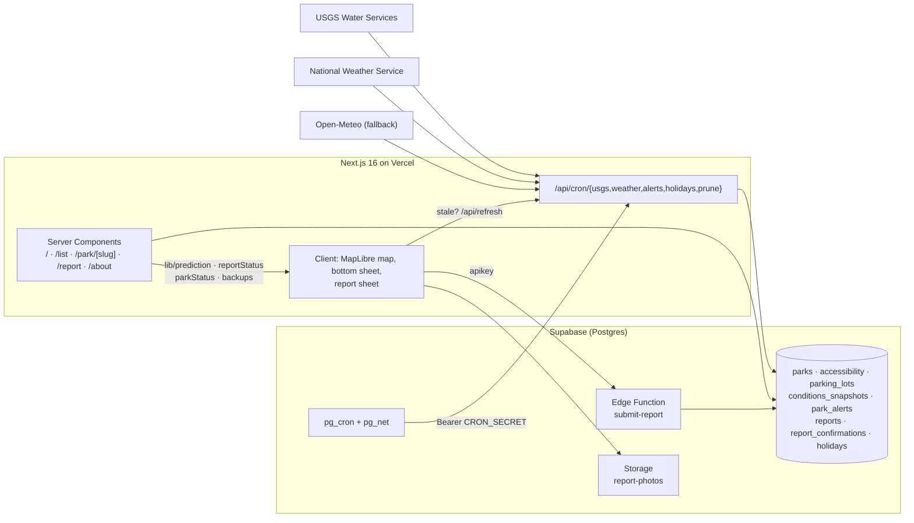

# LakeLens 🌊

**Know before you go.** Closure estimates, one-tap crowd reports, parking and accessibility for Florida's springs and state-park swim areas.

Built in 48 hours at **SASEhack 2026** by the team behind [BeachLens](https://beachlens.net) (~30k users). Same idea, new water: BeachLens covers Florida's beaches; LakeLens covers the springs, lakes and rivers inside Florida's state parks — the places that close at capacity before 10 AM on a summer Saturday.

**Live app:** https://lakelens-kenzo-fukudas-projects.vercel.app · **Tracks:** Social Impact + Best Design

---

## The problem

- Popular springs (Ichetucknee, Rainbow, Blue Spring, Wekiwa…) hit capacity on weekends and holidays and **close to everyone**, even people with reservations. Families find out at the gate after a two-hour drive.
- Nothing predicts *when* a park will fill, and nobody tells you which nearby park still has room.
- Visitors using wheelchairs can't tell in advance whether there's a ramp, an accessible restroom or a loaner beach wheelchair.
- Many springs have **no lifeguard**, underwater cave entrances that have killed untrained swimmers, 72 °F water that tires people fast, and river currents that change with rain. That information is scattered across a dozen sites.

## What LakeLens does

| Feature | How |
|---|---|
| **Map + list of every Florida state park with swimming** (69 parks) plus 7 deep-coverage springs | Curated data + FDEP GIS centroids; deep parks use spring-vent coordinates |
| **Closure estimate** ("likely fills around 9:35 AM") with the reasons shown | Transparent scoring model — see below. Always labelled *Estimate* |
| **One-tap visitor reports** (turned away / got in / line / lot full / gator / ramp blocked…) | Anonymous device id, no login; 5 reports / 10 min rate limit; reports fade after 2 h; 3 matching reports within 30 min = *confirmed* |
| **"Still full?" prompts** | Waze-style confirmation when a "full" report is getting old |
| **Backup suggestions** | When a park is full/closed: up to 3 nearby parks with room, drive time, parking and accessible-entry info |
| **Live conditions** | USGS river flow / level / water temperature, NWS forecast + active weather alerts (Open-Meteo fallback), refreshed by pg_cron |
| **Official closures as data** | Closures are `park_alerts` rows evaluated at request time — deactivate the alert and the park reopens automatically |
| **Safety card** | Lifeguard status, cavern warnings, current + cold-water advice, alcohol / life-jacket rules per park |
| **Parking + accessibility** | Curated lots (fees, ADA spaces, overflow, "no roadside waiting"), water-entry type, surfaces, restrooms — each marked *verified* or *unverified* with its source |
| **Installable PWA** | Manifest + service worker; works offline for the basics |
| **Accessibility first** | Status is always icon + text, never colour alone; 44 px targets; screen-reader-friendly list view; 200 % zoom safe |

## Architecture



- **Frontend:** Next.js 16 (App Router, ISR `revalidate = 60`), TypeScript, Tailwind v4 (CSS-first design tokens), MapLibre GL via `@vis.gl/react-maplibre` with keyless [OpenFreeMap](https://openfreemap.org) vector tiles, `vaul` for modal sheets, hand-rolled persistent bottom sheet.
- **Backend:** Supabase Postgres with RLS (public read, no anonymous writes to tables), Edge Function `submit-report` (validation + rate limiting, service-role insert, DB trigger as backstop), Storage bucket for report photos, `pg_cron` + `pg_net` scheduling the Next.js ingestion routes (USGS every 30 min, weather hourly, NWS alerts hourly, holidays monthly, prune nightly). Secrets live in Supabase Vault.
- **Pure logic** in `lib/` (no React/DB imports, 138 unit tests): prediction, report summarisation, status blending, backups, freshness, plain-language helpers.

### How the closure estimate works (`lib/prediction.ts`)

A transparent additive score, shown to the user as plain reasons:

| Factor | Points |
|---|---|
| Weekend | +2 |
| Public holiday or holiday weekend | +3 |
| College event / break (UF home games, spring break, summer) | +1–2 |
| Forecast high ≥ 90 °F / ≥ 95 °F | +1 / +3 |
| Rain chance ≥ 50 % | −2 |
| Active official closure or out of swim season (Blue Spring manatee season) | → **Closed** |

Score ≤ 0 → no closure expected · 1–2 → possible · ≥ 3 → likely. The park's *typical* weekend fill time (curated from official notices and news) is shifted **25 min earlier per point above 2**. Confidence reflects how much live data was available. It is an estimate and is labelled as one everywhere.

### How reports become a status (`lib/reportStatus.ts`, `lib/parkStatus.ts`)

1. Only reports from the last **2 hours** count; newer reports weigh more.
2. **3 matching reports within 30 minutes** → *confirmed*; 1–2 → *reported*.
3. A contradicting report (got in after turned away) lowers confidence; a majority of "no longer" confirmations clears the signal.
4. Final status priority: **official closure alert → swim season → confirmed reports → single report that agrees with the estimate → estimate alone → unknown**. The same function feeds the map, the list and the park page.

### Verified vs. sample vs. unverified

- Park facts for the 7 deep springs were curated from official pages, with `sources[]` recorded in `data/parks.deep.json`.
- Accessibility fields are marked **verified** only when an official page states them; everything else is **unverified** and says so.
- Demo reports are seeded with `is_sample = true` and rendered with a **Sample data** badge. Real reports have none.
- Official alerts are entered manually (Florida State Parks blocks server-side fetches) and are labelled "entered manually · last checked …".

## Data sources

- [USGS Water Services](https://api.waterdata.usgs.gov/) — river discharge, gauge height, water temperature (public domain)
- [National Weather Service API](https://www.weather.gov/documentation/services-web-api) — forecasts and active alerts (public domain)
- [Open-Meteo](https://open-meteo.com/) — weather fallback (CC BY 4.0)
- [Nager.Date](https://date.nager.at/) — US public holidays
- [OpenStreetMap](https://www.openstreetmap.org/copyright) contributors via [OpenFreeMap](https://openfreemap.org) — map tiles; Overpass API — parking lots
- [FDEP Florida State Parks boundaries](https://geodata.dep.state.fl.us/) — park centroids
- Florida State Parks, Alachua County Parks, Ginnie Springs Outdoors — hours, fees, rules, accessibility (curated by hand)

## Run locally

```bash
cp .env.example .env.local   # Supabase URL + keys, CRON_SECRET, ADMIN_TOKEN
npm install
npm run dev
```

- `npm test` — vitest (prediction, reports, status, backups, ingestion normalisers, seed validation)
- `npm run lint` · `npm run build`
- `node --experimental-strip-types scripts/build-seed.ts` — regenerate `supabase/seed.sql` from `data/*.json`
- Migrations: `supabase/migrations/*.sql` (`npx supabase db push --include-seed`), one-time Vault setup in `supabase/migrations/README.md`
- Edge Function: `npx supabase functions deploy submit-report --use-api`

## Repository map

```
app/            routes (map, list, park/[slug], report, about, offline) + /api (cron, refresh, admin alerts, reports fallback)
components/     ui primitives · map · list · sheet · park sections · report flow · nav · pwa · a11y
lib/            pure logic (prediction, reportStatus, parkStatus, backups, freshness…) · ingest (usgs, nws, openMeteo) · queries · supabase clients
data/           curated JSON: deep parks, accessibility, parking, alerts, sample reports, events, holidays, basic parks
scripts/        seed builder, FDEP / NWS / Overpass / holiday fetchers
supabase/       migrations, seed.sql, config, functions/submit-report
tests/          ingestion fixtures + tests, seed validation
```

## Roadmap

Florida lakes and rivers → Great Lakes rip currents → Army Corps of Engineers lakes → one BeachLens app for all water. Stretch: Claude-assisted classification of free-text report notes, algae alerts, USGS sparklines.

## Team

BeachLens team · SASEhack 2026. Built with Next.js, Supabase, Vercel and Claude Code.

## Disclaimer

Informational only. Conditions change quickly and estimates can be wrong. Follow posted rules and park staff. LakeLens is not affiliated with Florida State Parks or any park operator.
